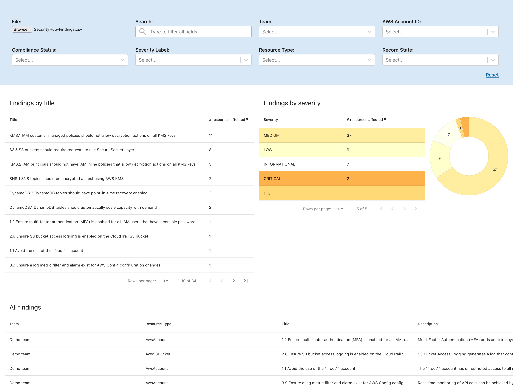

# Security Hub monitor

## Description

This is a tool to take the data published by the [security-hub-collector](https://github.com/CMSgov/security-hub-collector) and allows
you to filter and display the results.

## General Usage

- Go into the `./build` directory, and run the `server` executable appropriate for your platform.
  - e.g. For MacOS, you would run `server-darwin`
- Open `http://localhost:8080` in your browser.

## Development

Make sure you have a recent version of node.js installed and available and are able to run `npm`

### Install dependencies

`npm i`

### Build a static version

`npm run build`

### Serve the static version locally

`serve -s build`
